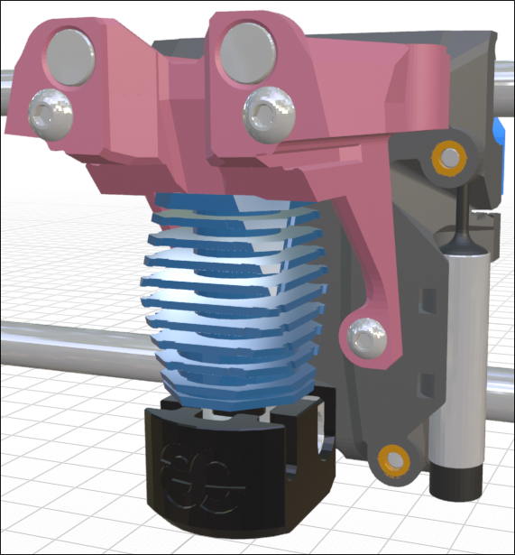
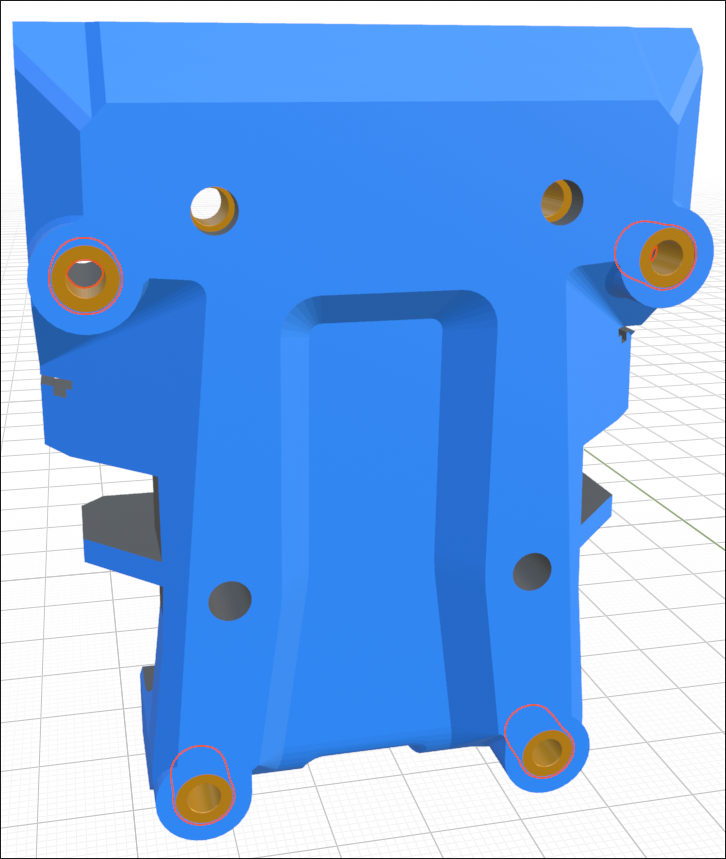
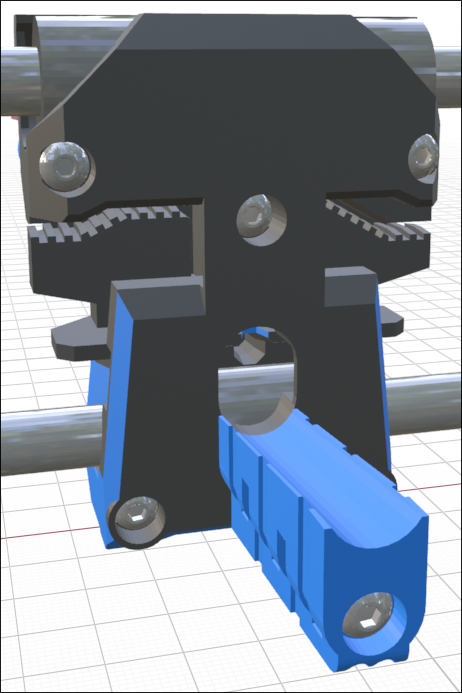

## Prusa X-Carriage

I have designed a backplate that allows the Mini Stealth to be installed onto a Prusa MK3 series printer. It might fit the MK4 as well but I cannot validate this.

This setup should fit most all of the hotends supported by the Mini Stealth. The extruders with low seating stepper motors will have collision issues with the upper LM8UU bearings. The following extruders should be viable options but may still be a tight fit:

- Sherpa Mini

- Sherpa Micro

- Galileo 2 SA

- WristWatch BMG

- WristWatch G2

- Vz Hextrudort CNC

- LGX Lite

- Hummingbird

- Creality K1

It uses a new, more rigid, set of core pieces that I have recently developed. I kept the Prusa geometry and assembly as similar to standard as possible but this design does require eight M3x4x5 heat-set inserts; four to assemble the x-carriage and four to mount the Mini Stealth. It still uses one M3 square nut and an M3 hex nut to secure the stock Prusa cable-holder.

### Hardware

- 8x M3x4x5 Heat-set inserts (Voron Standard)

- 2x M3x45 BHCS - secure core piece to x-carriage

- 2x M3x14 BHCS - secure core piece to x-carriage

- 1x M3x40 BHCS - secure Prusa cable-holder

- 1x M3 Hex nut - secure Prusa cable-holder

- 4x M3x20 BHCS - assemble front and back x-carriage pieces

- 1x M3x10 BHCS - assemble front and back x-carriage pieces

- 1x M3 Square nut - assemble front and back x-carriage pieces

- 2x Zip-ties - secure front x-carriage piece to top LM8UU bearings

- 6x Zip-ties - bottom cable routing along cable-holder

- 2x Zip-ties - secure side mounted PINDA probe
