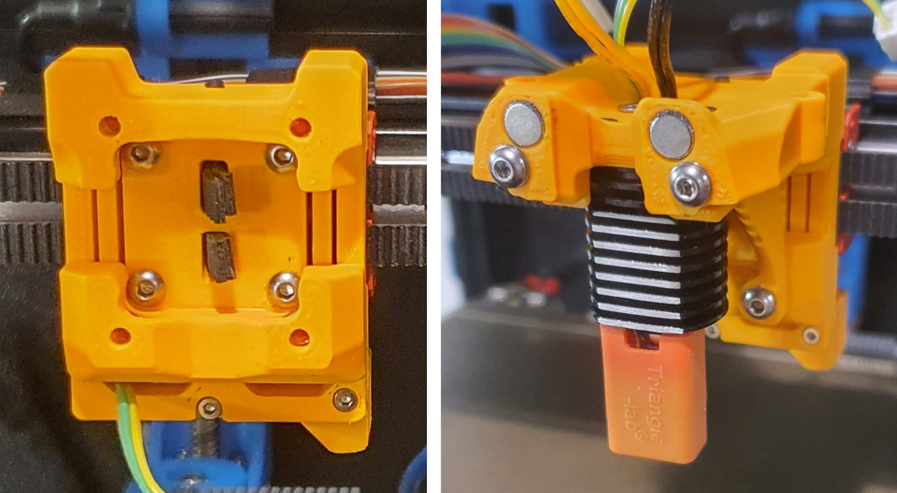
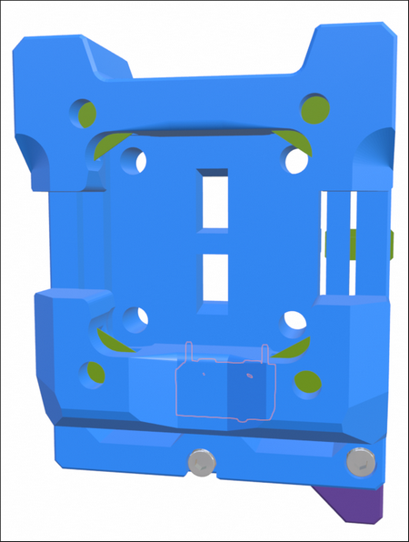
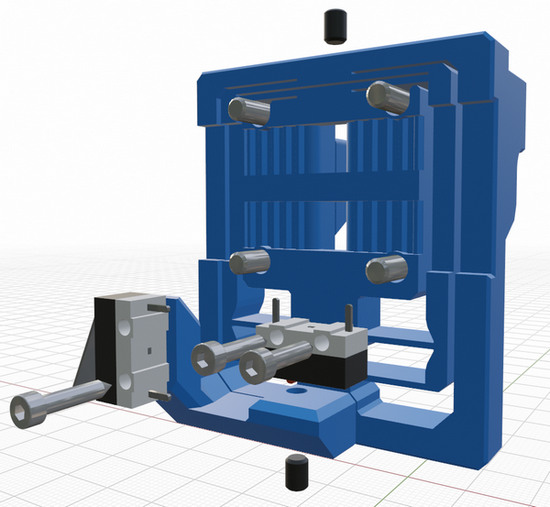
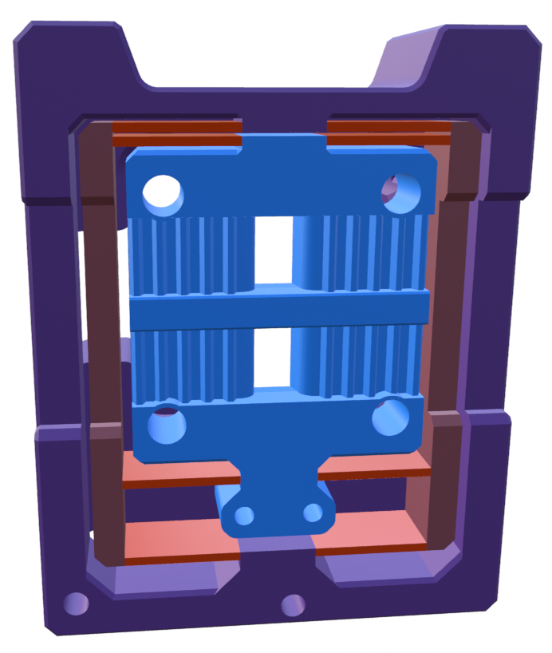
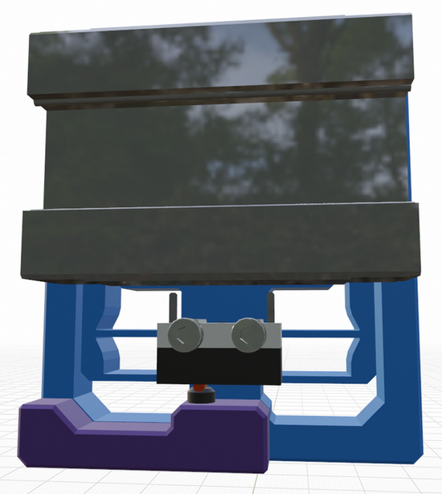
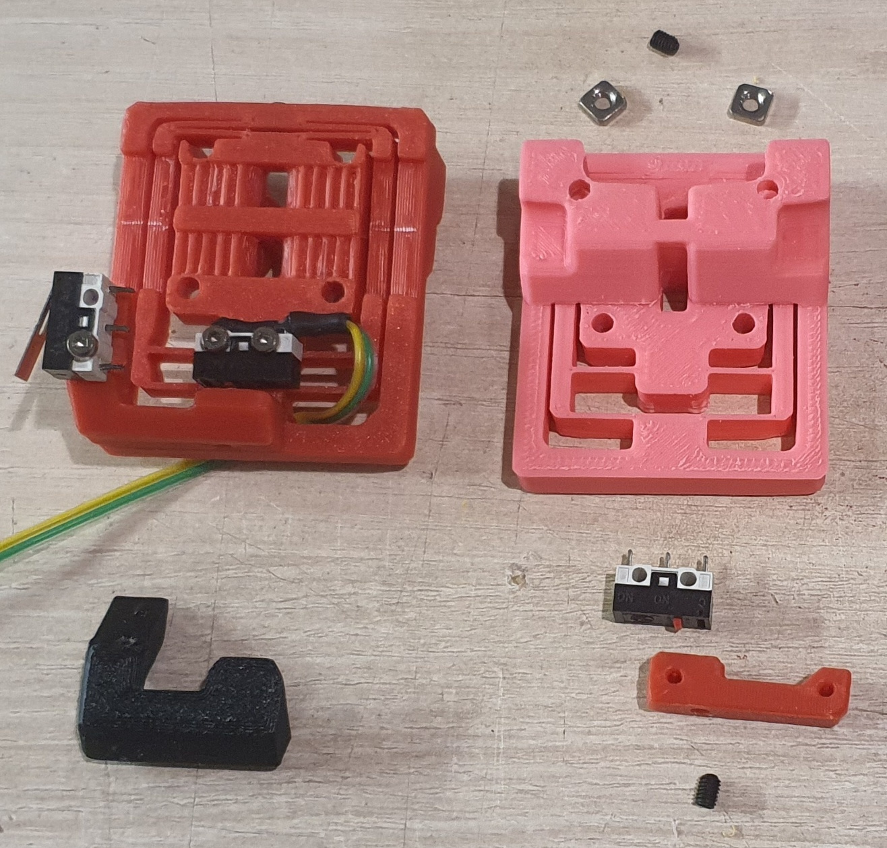
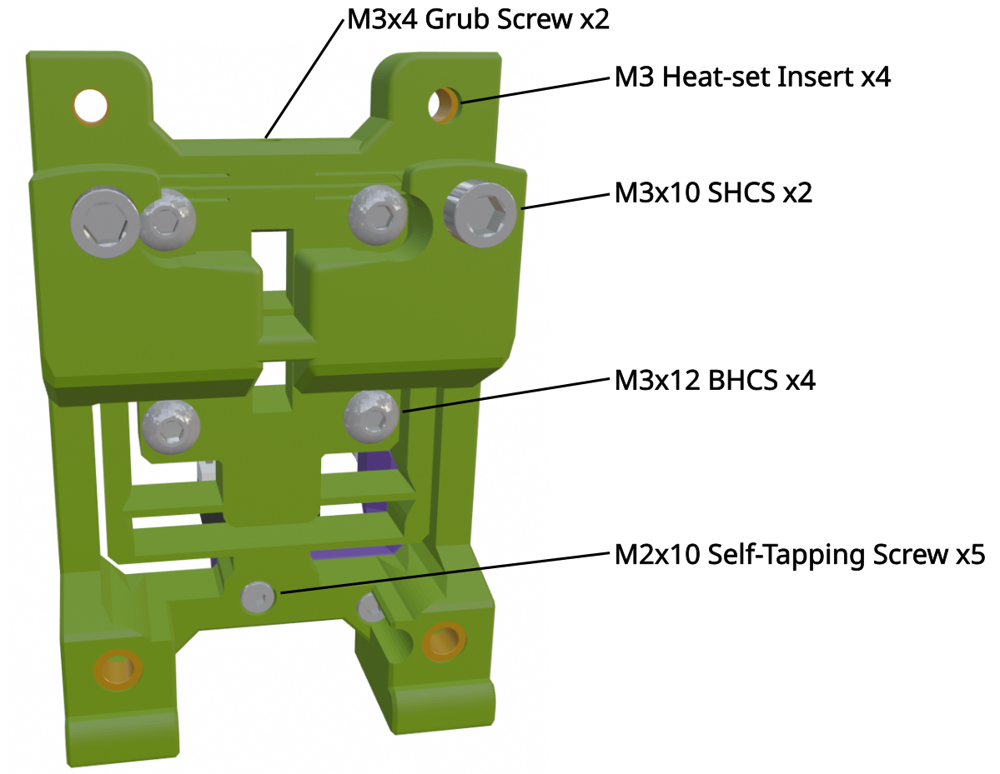
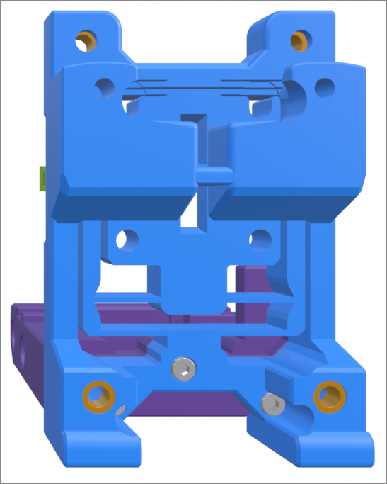

## Mini Stealth DAB

This is a flexure based nozzle probing option for mounting the Mini Stealth toolhead in a Voron Trident or V2.4. It uses a simple linear compliant mechanism to provide ~0.5mm of Z travel while being quite rigid in the other axes. It weighs around 20g fully assembled with Z and X endstops. It should require the same Print_Start preparations as the Voron TAP to ensure a clean nozzle and accurate probing. While probing with a scale on top of the bed, it applys about 600g of force.

The new version of the DAB has been adapted to work with my new rigid core pieces. This combination is more reliable than before. While probing, the old version would flex back before lifting the toolhead. It now creates a box structure centered on the linear carriage which restrains the movement better along the Z axis.

There are a few supports (shown in green) built in to make printing more reliable. After printing, the two inner sections will need to be gently, but firmly, pried apart from the two bridge sections while being careful not to plastically deform the flexures. There are four pockets for M3 square nuts to secure the Mini Stealth core piece using two M3x45 BHCS at the top and two M3x12 BHCS on the bottom.

There are several different rear boss pieces depending on where you have your X endstop mounted. This piece is secured with a pair of M2x10 self tapping screws.

The flexure works as shown below. The blue center section is fixed to the MGN12H linear carriage. The magenta vertical bars are the intermediate phase and the purple outside frame is the final phase of the flexure. The red bars are the actual flexing parts and are 0.8mm thick.

### Assembly

- After ensuring that the flexure moves freely, install one of the grub 
  screws in the top and screw it in just enough to remove the reverse Z travel in
   the flexure. This provides a known lower limit of travel.

- Install the Z_Stop_Boss with two M2 x 10 screws from the front.

- Install the Z micro-switch with the red trigger on the left 
  (viewed from the back). The wires can be fed to the front through the 
  lower gap in the flexure.

- Install the other M3 grub screw on the bottom of the DAB_Z_Boss. Screw
   it in until you hear the micro-switch trigger, then slowly turn it back out
   until the trigger releases. This makes the trigger travel distance less
   than 0.5mm.

- Mount the x-carriage to the MGN12C carriage with four M3x12 BHCS. 
  There is room to pull the four belt ends through and trim them at the 
  front face of the DAB.

### Stealthburner Version

This version of DAB is a drop-in replacement for the Stealthburner x-frame pieces. It uses slightly different hardware than the official Stealthburner assembly, as shown in the picture below.

### Stealthburner on a Switchwire

This version of DAB fits a Stealthburner onto a Switchwire. It is printed in two parts and assembled with three M2x10 self tapping screws.

 

This is still in Beta and I would appreciate any feedback. I am active on [TeamFDM.com](https://www.teamfdm.com/files/file/760-mini-stealth-dab-beta-release/) and will also keep an eye on any issues posted here.
