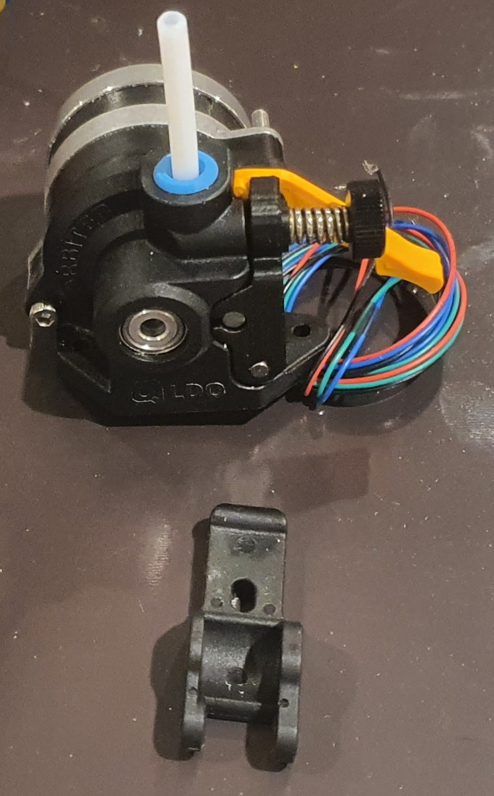

## Mini Stealth - Orbiter 2.0

This version of the Mini Stealth is based on the Orbiter 2.0 mounting pattern and can fit the [Galileo SA](https://github.com/JaredC01/Galileo2/tree/main/galileo2_standalone) extruder as well. There are subfolders with the shrouds and other components specific to each extruder.

I have developed a filament release lever for the Orbiter 2.0 which fits over the M3x20 SHCS securing the stepper motor and uses it as the pivot point. It is designed around a smooth socket head cap screw that should have an outer diameter of 5.4mm. The stock idler arm is too tall to fit inside of the Mini Stealth unless using a Crop-Top version. 

To install the release lever, you must remove the idler arm and the stepper motor screw. Then place the release lever in position and thread the stepper screw through the hole in the release lever.

The Galileo Standalone extruder requires a modified idler arm to fit cleanly inside of the Mini Stealth unless using a Crop-Top version. Their filament advance thumb screw will also collide with a non Crop-Top Mini Stealth.

For more information, questions and feedback, I am most active at [TeamFDM.com](https://www.teamfdm.com/files/file/612-mini-stealth-orbiter-20/?tab=comments) but the files here are the most current.
